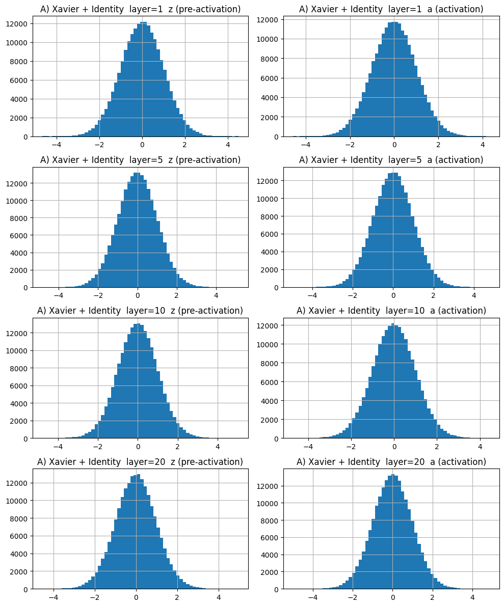
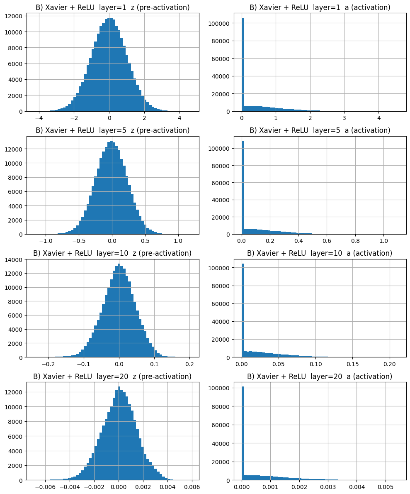
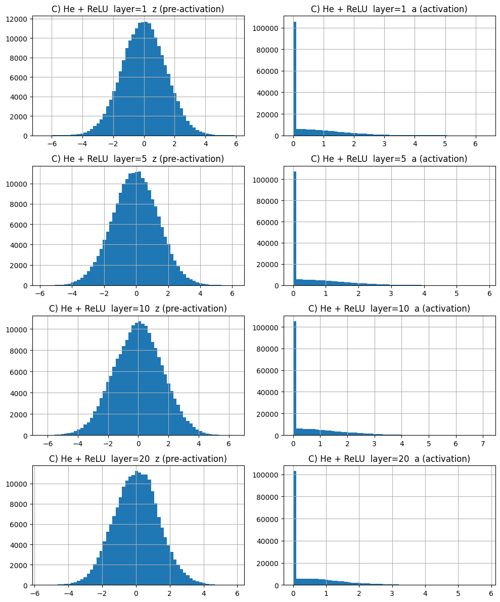
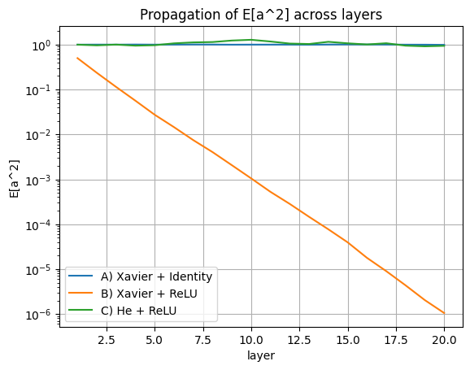
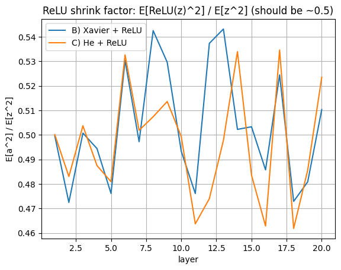
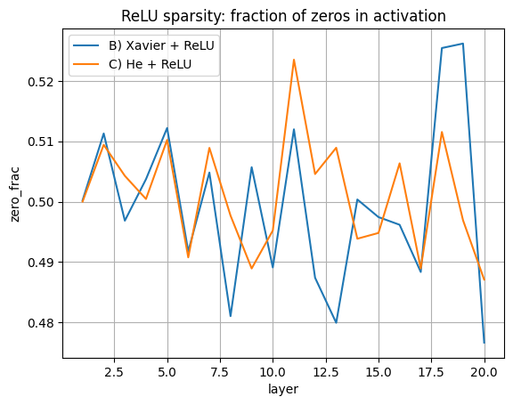

# relu_spread_check

# ReLU Spread Check

このリポジトリは、重み初期化（Xavier / He）と活性化関数（Identity / ReLU）の組み合わせが、層を深くしたときのアクティベーションの「広がり」に与える影響を、**分布（ヒストグラム）**と**集約指標（2乗平均など）**の両方で確認するための最小実験である。

## 実験の結論（要約）

今回の結果は、次の3点を分布と集約指標の両面から確認できている。

- **ReLU は**（広がり＝2乗平均で見たとき）**`E[a^2] / E[z^2] ≈ 1/2`** になる
- そのため **Xavier（線形前提のまま）＋ReLU** だと層を跨ぐたびに信号エネルギーが半減し、深層で消える
- **He** はこの半減（≈1/2）を見込んで重み分散を2倍にしているため、深層でもエネルギーが保たれる

ここで、各層で
`z = xW^T`（pre-activation）, `a = φ(z)`（activation）を繰り返す。

---

## 実行方法

```bash
python relu_spread_check.py
````

実行すると `figures/` 以下に図が出力される。

---

## 図と解釈（レポート）

### 0. 実験の前提（図が表しているもの）

各層で

* `z = xW^T`（プレアクティベーション）
* `a = φ(z)`（アクティベーション）

を計算し、層番号 **1, 5, 10, 20** の `z` と `a` の分布（ヒストグラム）を可視化している。
「広がり」は主に **2乗平均 `E[·^2]`** で評価する（ReLUの「約1/2」は分散Varではなく `E[·^2]` の関係）。

---

### 1. A) Xavier + Identity

#### 観察

* 左列（`z`）は各層でほぼ同形状・同スケールの正規状を維持する。
* 右列（`a`）はIdentityなので `a = z`。左右が一致する。

#### 解釈

Xavier（ここでは `std = 1/√n`）は「線形（Identity）を前提」にスケール維持（`E[x^2]`が層で暴れない）を狙っている。
この図は、その前提が満たされるときに狙いどおり挙動することを示す。



---

### 2. B) Xavier + ReLU

#### 観察

* 右列（`a`）に **0の巨大スパイク**が立つ（ReLUが負側を厳密に0へ潰すため）。
* 層が深くなるほど、左列（`z`）の分布幅が急速に縮み、0付近に押しつぶされる。
* 右列（`a`）の正の尾も縮み、0近傍に張り付く。

#### 解釈

Xavierは線形前提でスケール維持を狙うが、ReLUを通すと（`z`が概ね0対称なら）

`E[ReLU(z)^2] ≈ (1/2) E[z^2]`

となり、**層ごとにエネルギー（2乗平均）が半減**する。
補正がないため、層を跨ぐほど指数的に縮み、深層で信号が実質的に消える（勾配消失側の問題につながる）。



---

### 3. C) He + ReLU

#### 観察

* 右列（`a`）に0スパイクは立つが、深層でも正の尾のスケールが崩れにくい。
* 左列（`z`）の分布幅も深さに対して大きく縮まない。

#### 解釈

He初期化は `Var(w)=2/n`（`std=√(2/n)`）とすることで、ReLUの半減（≈1/2）を見越して

* `z` 側を（2乗平均的に）おおむね2倍
* ReLUで半減して `a` を元のスケールへ戻す

という設計になっている。結果として深層でも `E[a^2]` が保たれやすい。



---

## 集約指標による裏取り

### 4. 層方向の `E[a^2]` 推移

縦軸は各層出力の **2乗平均 `E[a^2]`**（ログスケール）。

* A（Xavier + Identity）はほぼ水平（維持）
* C（He + ReLU）もほぼ水平（維持）
* B（Xavier + ReLU）は指数減衰（ログ軸で直線的に低下）



---

### 5. ReLUの縮み率 `E[a^2]/E[z^2]`

ReLUによる縮み率
`E[ReLU(z)^2] / E[z^2]`
が層ごとに概ね0.5付近で推移していることを示す。
これは「ReLUを通すだけで（2乗平均の意味で）広がりが約1/2になる」を直接に確認する図である。



---

### 6. ReLUのスパース性（ゼロ比率）

各層で `a == 0` となる割合（zero fraction）を示す。
`z` が概ね0対称なら正負は半々なので、ReLUにより **約半分が0** になりやすい。ヒストグラムの0スパイクを単一指標で裏取りしている。



---

## まとめ

* **Xavierは線形（Identity）前提ではスケール維持に成功する**
* **ReLUは `E[ReLU(z)^2] ≈ (1/2)E[z^2]` を生む**
* **Xavier + ReLU はこの半減を補正しないため深層で `E[a^2]` が消える**
* **He + ReLU は半減を見込んで補正しており、深層でも `E[a^2]` を保ちやすい**

---

